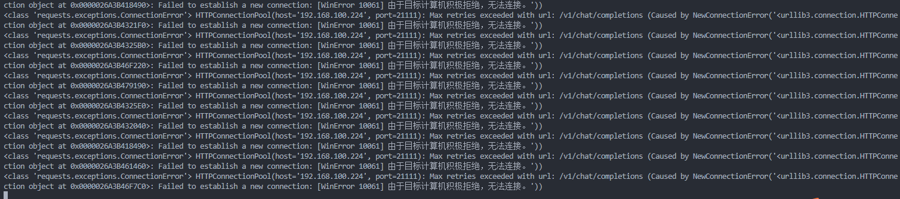

# 2024年2月5日 日报

拿到了锐捷完整的数据集，里面的结果是锐捷领航员是否可以搜索到正确的结果，和根据搜索到的结果能不能正确回答用户问题，现在的目标改为：

1. 72b相关性结果是否一致
2. 72b最终答案结果是否一致
3. ragas的72b得分结果是否一致期望输出一份表,新加这三个字段

目前的现状是代码已经改好了但是遇到了网络问题，下午排查完确定是72b接口的问题，等那边修好我就可以继续了
